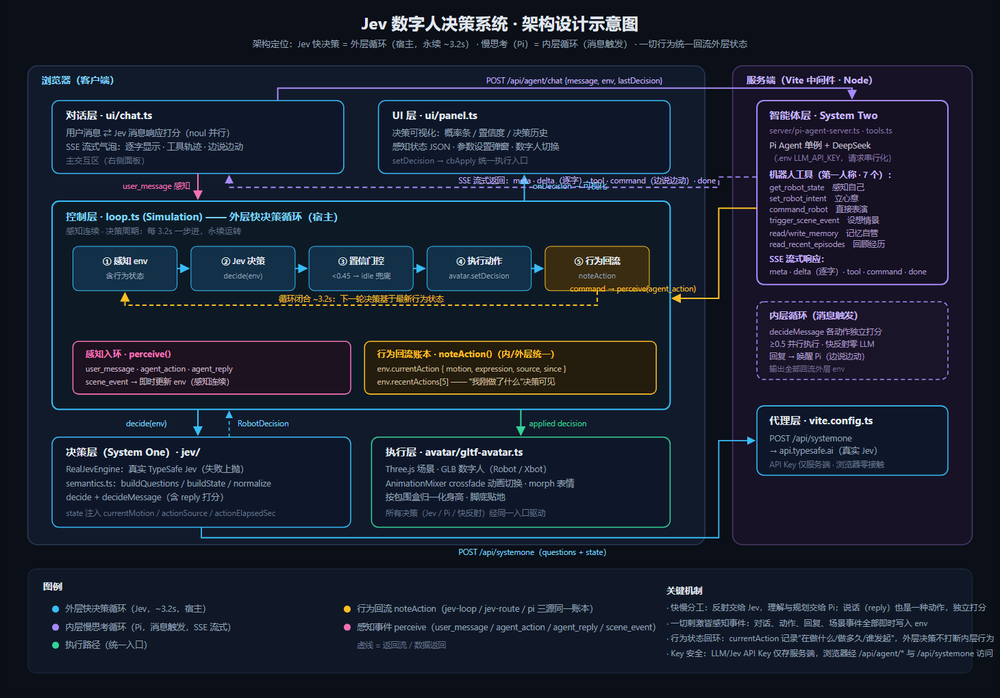

# SystemOneModel · 给 AI 一个身体

让大模型拥有一个真实可动的"身体"：以 **双系统决策架构** 驱动 3D 数字人，快思考负责秒级自主行动，慢思考负责自然语言规划与工具调用。

> 本仓库目前包含演示项目 [jev-robot-digital-human](./jev-robot-digital-human)。

## 原理

核心理念：**决策层与执行层彻底解耦；Jev 快决策是外层循环（宿主，永续步进），慢思考是内层循环（消息触发），一切行为统一回流外层状态**。

```
                        用户对话（自然语言）
                              │ 消息触发（内层循环入口）
                              ▼
                ┌─────────────────────────────┐
                │  System Two · 慢思考（内层）    │
                │  Pi Agent（DeepSeek）         │
                │  规划 · 7 工具 · 记忆读写       │
                └──────┬──────────────┬───────┘
   低频指令（set_intent │              │ 行为回流（perceive/noteAction）
   /command/event）    │              │ 一切行为统一写入外层行为账本
                       ▼              │
   ┌──────────────────────────────────┴────────────┐
   │    System One · 快思考（外层循环 · 宿主）          │
   │    Jev 决策模型（TypeSafe）· ~3.2s 永续步进        │
   │                                               │
   │    ① 感知 env → ② 决策 → ③ 置信门控 → ④ 下发执行  │
   │        ▲                         │             │
   │        └─── ⑤ noteAction 回流 ◀──┘              │
   │    行为账本 env.currentAction：                   │
   │    在做什么 / 做了多久 / 谁发起（决策不打断内层行为）  │
   └──────────────────┬────────────────────────────┘
                      │ 高频决策（动作/表情/强度/朝向 + 置信度）
                      ▼
                ┌─────────────────────────────┐
                │  执行层 · 3D 数字人            │
                │  Three.js + GLB 骨骼动画       │
                └─────────────────────────────┘
```

详细分层架构示意图：



### 1. System One：Jev 快思考（高频自主决策）

- 决策循环以固定间隔（默认 ~3.2s，可配 800–6000ms）运行：把环境感知状态（意图、用户距离、前方障碍、能量）交给 **Jev 决策模型**，输出**类型化决策**——动作(choice) + 表情(choice) + 强度(score) + 朝向(noul)，附带概率分布与置信度。
- **置信度门控**：置信度低于阈值时强制回退到安全的 `idle` 动作，杜绝低把握的乱动。
- **感知失败兜底**：决策请求失败时以 `idle` 安全动作继续循环，身体永不"卡死"。
- **消息响应也是决策**：收到用户消息时，Jev 对"回复"与各动作并行打分——动作与回复可同时触发（边跳舞边说话），纯动作反射零 LLM 调用。
- **行为统一回环（外层循环宿主）**：一切行为（循环自身 / 消息快反射 / 慢思考指令）都经 `noteAction()` 写入同一行为账本——`currentAction`（在做什么/多久/谁发起）+ `recentActions`，下一轮决策可见，不会无脑打断内层行为。

### 2. System Two：Pi 智能体慢思考（自然语言规划）

- 用户通过对话界面用自然语言指挥机器人，服务端 Pi Agent（默认接入 DeepSeek）按需调用 7 个第一人称工具（4 身体 + 3 记忆）：
  - 身体能力：`get_robot_state` 感知自己 · `set_robot_intent` 立心意（交外层循环自主执行）· `command_robot` 直接表演 · `trigger_scene_event` 设想情景（触发 Jev 快思考响应）
  - 记忆能力：`read_memory` / `write_memory` 自主读写记忆文件（`data/memory/*.md`）· `read_recent_episodes` 回顾情景流水
- SSE 流式响应：回复逐字显示、工具轨迹实时追加、指令边说边动；指令回到浏览器侧按序安全应用，全程留有工具调用轨迹。

### 3. 关键设计

- **Schema 即契约**：决策的问题/答案/归一化统一在 `semantics.ts` 中定义，决策层只依赖 schema，与渲染完全解耦。
- **记忆即工具**：情景记忆（`data/episodes.jsonl`）自动入档；记忆文件由 Agent 经工具自主读写与组织（服务端只提供存储与索引，无写死提炼流程），闲时自主 `consolidate` 整理，重启后对话无缝续聊。
- **Key 安全**：所有 API Key 仅存服务端（Vite 中间件代理），浏览器零接触。
- **执行器归一化**：GLB 模型按包围盒归一化身高、脚底贴地，动画 crossfade 平滑切换、morph 表情，可插拔更换数字人。

## 快速开始

环境要求：Node.js 18+。

```bash
cd jev-robot-digital-human
npm install
npm run dev        # 打开 http://localhost:5173
```

在 `jev-robot-digital-human/.env` 配置密钥：

```bash
# System One：Jev 决策模型
TYPESAFE_API_KEY=your_key

# System Two：Pi 智能体（默认 DeepSeek）
LLM_API_KEY=sk-xxx
LLM_API_BASE=https://api.deepseek.com/v1
# 可选：显式指定模型，格式 provider/model（默认自动探测 deepseek-v4-pro / deepseek-flash）
# PI_AGENT_MODEL=deepseek/deepseek-flash
```

常用脚本：

```bash
npm run dev         # 开发服务器（含 API 代理与智能体端点）
npm run build       # 生产构建
npm run typecheck   # tsc --noEmit 类型校验
```

## 体验路径

1. 点击右上角 `▶ 启动循环`——数字人开始按 Jev 决策自主行动（System One）。
2. 在右侧对话区用自然语言指挥，例如：
   - "欢迎一下我" → `command_robot(wave, happy)` 直接执行
   - "跳个舞庆祝一下" → 跳舞指令 + 庆祝场景事件
   - "前方有障碍物怎么办" → `set_robot_intent(避障)`，后续循环自主避让
   - "记住哦，我最喜欢的音乐是电子舞曲" → 对话入情景记忆，闲时自动整理为记忆文件
3. 机器人闲下来会自主整理记忆：它会"自己想一想"把值得记的写进 `data/memory/*.md`（💭 气泡展示小结）；重启 dev server 后对话无缝续聊，它仍记得你的偏好。
4. 点击 `⚙ 参数设置` 调整决策间隔、置信度门控阈值、切换数字人（RobotExpressive / Xbot）。

## 目录结构

```
SystemOneModel/
└── jev-robot-digital-human/     # 双系统数字人控制演示
    ├── index.html               # 页面骨架 + 控制面板 + 对话区
    ├── vite.config.ts           # Vite 配置 + Jev 代理 + Pi 智能体插件
    ├── server/                  # pi-agent-server.ts（System Two）+ tools.ts（7 工具）+ memory-store.ts（记忆存储）
    ├── data/                    # 记忆持久化（episodes.jsonl + memory/*.md，运行时生成，gitignore）
    ├── docs/                    # 架构文档与示意图（architecture.md / architecture-diagram）
    ├── public/models/           # RobotExpressive.glb / Xbot.glb
    └── src/
        ├── main.ts              # 装配根 + 渲染循环 + 指令应用
        ├── loop.ts              # 决策循环 Simulation（外层宿主 + 门控 + 感知入环 + 行为回流）
        ├── jev/                 # 决策层：引擎 / HTTP 客户端 / schema
        ├── avatar/              # 执行层：GLB 数字人执行器
        └── ui/                  # 控制面板 + 对话舱
```

## License

[MIT](./LICENSE)
