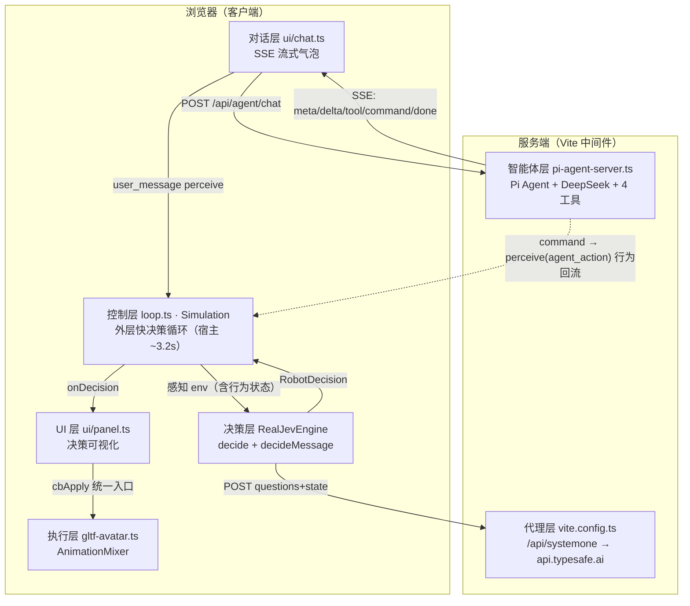

# Jev 数字人决策系统 · 架构设计文档

> 配套示意图：[architecture-diagram.html](./architecture-diagram.html)（浏览器打开，矢量可缩放）
> 本文描述当前代码实态，与实现同步维护。

## 1. 架构定位

**Jev 快决策是外层循环（宿主），慢思考（Pi）是内层循环（被消息触发）；一切行为统一回流外层状态。**

| 维度 | System One（Jev 快思考） | System Two（Pi 慢思考） |
|------|--------------------------|--------------------------|
| 位置 | 浏览器内，永续运转 | 服务端 Vite 中间件 |
| 模型 | TypeSafe Jev（/api/systemone） | DeepSeek（pi-agent-core） |
| 周期 | ~3.2s 步进 | 用户消息触发，请求串行化 |
| 职责 | 反射式感知-决策-执行 | 对话理解、意图规划、复杂行为编排 |
| 失败策略 | 上抛，调用方以 `idle` 兜底 | 回复决策失败默认唤醒 Pi |

设计哲学：**一切刺激皆感知事件；决策即行为（说话 reply 也是动作选项）；快慢分工——反射交给 Jev，理解与规划交给 Pi。**

## 2. 分层结构

```
浏览器（客户端）
├─ 对话层  ui/chat.ts        用户消息 ⇄ Jev 消息打分；SSE 流式气泡（逐字+边说边动）
├─ UI 层   ui/panel.ts       决策可视化（概率/置信/历史）、感知状态 JSON、参数弹窗
├─ 控制层  loop.ts           Simulation：外层循环宿主、感知入环、行为回流账本
├─ 决策层  jev/              RealJevEngine + semantics（schema 契约）
└─ 执行层  avatar/gltf-avatar.ts  Three.js GLB 数字人，AnimationMixer crossfade

服务端（Vite 中间件 · Node）
├─ 智能体层 server/pi-agent-server.ts  Pi Agent 单例 + 4 工具 + SSE 流式
└─ 代理层   vite.config.ts             /api/systemone → api.typesafe.ai（Key 仅服务端）
```

## 3. 双决策闭环

### 3.1 外层循环（System One · 永续）

```
场景事件 / 环境漂移 / 行为回流
  → env {intent, userProximity, obstacleAhead, energy,
         currentAction, recentActions, socialDrive, ...}
  → engine.decide(env)            真实 Jev，失败上抛 → idle 兜底
  → 置信度门控                    confidence < gate(0.45) → motion 强制 idle
  → panel.setDecision()           概率条 / 置信度 / 决策历史
  → avatar.setDecision()          AnimationMixer 播放
  → sim.noteAction(applied, 'jev-loop')   行为回流，下一轮决策可见
```

每轮决策的 state 中注入 `currentMotion / currentExpression / actionSource / actionElapsedSec`，Jev 明确知道"我此刻在做什么、做了多久、谁发起的"，**不会无脑打断内层行为**（instructions 明确要求 deliberate 地保持或切换）。

### 3.2 内层循环（消息触发，输出回流外层）

```
用户消息 → engine.decideMessage(env, message)
  每个动作（含 reply「说话」）独立 noul 打分，instructions 注入当前动作状态
  阈值(0.5)以上并行执行：
  → 舞动 68%✓ + 回复 67%✓ → 边跳舞边唤醒 Pi 生成语言回复
  → 仅动作触发（如舞动 98%）→ 快反射直接执行，零 LLM 调用
  → 仅回复触发 → 纯慢思考对话
  → 执行后 sim.perceive(agent_action / agent_reply) 回流外层 env
```

### 3.3 System Two（Pi 慢思考，服务端）

```
POST /api/agent/chat {message, env, lastDecision}
  → Pi Agent (DeepSeek) 按需调用工具（第一人称视角）：
     get_robot_state      感知自己（env / 决策 / 行为状态快照）
     set_robot_intent     立心意 → sim.patchEnv()
     command_robot        直接表演（动作/表情/强度/朝向）
     trigger_scene_event  设想情景 → sim.triggerEvent()（走 Jev 快思考响应）
  → SSE 流式响应（浏览器手动读 res.body.getReader() 解析）：
     meta    {model}                          模型标识
     delta   {text}                           文本增量 → 气泡逐字追加
     tool    {tool, args}                     工具开始 → 轨迹实时追加
     command {AgentCommand}                   工具执行即下发 → 边说边动
     error   {error}                          异常
     done    {reply, commands, tools, model}  收尾汇总
```

## 4. 行为回环（状态账本统一）

无论行为来自何处，执行后统一经 `sim.noteAction()` 回流：

| 来源标签 | 触发路径 |
|----------|----------|
| `jev-loop` | 外层循环自身决策（step 内） |
| `jev-route` | 消息快反射（decideMessage 打分触发的身体动作） |
| `pi` | 慢思考 command_robot 指令 |

```ts
// env 中的行为状态
currentAction: { motion, expression, source, since }  // 同一动作延续不重置 since
recentActions: string[]                               // 最近 5 条，如 "dance(pi)"
```

实测回环链路：`dance(jev-route) → dance(pi) → idle(jev-loop) → dance(jev-loop)`——外层继承庆祝意图、置信 100% 主动续舞。

## 5. 整体数据流（Mermaid）



## 6. 关键设计决策

1. **Schema 即契约**（semantics.ts）：questions / state / normalize 集中定义，MOTION/EXPRESSION 列表由常量自动注入，避免硬编码漂移。
2. **三级兜底链**：Jev 置信度门控（<0.45 → idle）→ 引擎失败上抛（无本地 Mock）→ 消息响应失败默认唤醒 Pi。
3. **决策与渲染完全解耦**：决策层只产出 `RobotDecision`，执行层只消费 normalized decision；所有决策（Jev/Pi/快反射）经同一入口（panel.cbApply）驱动数字人。
4. **Key 安全**：LLM / Jev API Key 仅存服务端（.env + 代理），浏览器零接触。
5. **Agent 第一人称**：工具描述与返回文本均以"你"叙述（智能体即机器人本体），系统提示词包含身份定位、双系统心智隐喻、行为原则。
6. **边说边动**：SSE `command` 事件在工具执行时实时下发，不等文本生成完毕。

## 7. 目录结构

```
jev-robot-digital-human/
├─ index.html                  # 页面骨架 + 对话区开场白（第一人称）
├─ src/
│  ├─ main.ts                  # 装配：sim/avatar/panel/chat 接线 + applyAgentCommand
│  ├─ loop.ts                  # Simulation：外层循环、perceive、noteAction、patchEnv
│  ├─ style.css
│  ├─ jev/
│  │  ├─ types.ts              # 类型 re-export
│  │  ├─ semantics.ts          # schema 契约：buildQuestions/buildState/normalize
│  │  ├─ decision-engine.ts    # RealJevEngine（唯一引擎，失败上抛）
│  │  └─ jev-client.ts         # /api/systemone 客户端
│  ├─ ui/
│  │  ├─ panel.ts              # 决策可视化 + 参数弹窗 + cbApply
│  │  └─ chat.ts               # 对话舱：SSE 流式解析、消息收发、工具轨迹
│  └─ avatar/gltf-avatar.ts    # Three.js GLB 数字人封装
├─ server/
│  ├─ pi-agent-server.ts       # Pi 智能体（System Two）+ SSE + /api/agent/consolidate
│  └─ memory-store.ts          # 三层记忆：episodes.jsonl / long-term-memory.json / 整理游标
├─ data/                       # 记忆持久化（gitignore）：情景记忆 + 长期记忆
├─ docs/
│  ├─ architecture.md          # 本文档
│  ├─ architecture-diagram.html# 架构示意图
│  └─ agent-memory-loop-design.md  # 记忆回环设计（P1–P3 已全部实施）
└─ vite.config.ts              # 代理层 + 服务端中间件挂载
```

## 8. 记忆回环（P1–P3 已实施）

| 阶段 | 内容 | 状态 |
|---|---|---|
| **P1 感知入环** | `sim.perceive()` 事件队列：用户消息/Pi 行为/回复/场景事件即时写入 env（socialDrive/userProximity/recentInteraction/memoryDirty） | ✅ |
| **P2 记忆存储** | `server/memory-store.ts`：情景记忆 `data/episodes.jsonl`（追加写，近 500 条驻内存）+ 记忆文件目录 `data/memory/*.md`（Agent 经工具自读写）；对话/动作/情景自动入档；服务重启把近 30 条对话回放为 Agent 消息（无缝续聊）；工作记忆注入 Jev（`recentDialogue` 最近 3 轮 + `lastConsolidatedAt` 游标随 buildState 下发） | ✅ |
| **P3 idle 整理** | **整理也是动作**：`consolidate` 进入 Jev 决策空间（外层循环 choice 选项 + 消息响应 noul 打分）；执行层表现为静立沉思（idle + 0 强度）并调 `POST /api/agent/consolidate`，向主 Agent 发起"独处整理"内心活动；**记忆即工具**——Agent 经 `read_recent_episodes`/`read_memory`/`write_memory` 自己回顾经历、自己组织并写入 `data/memory/*.md` 记忆文件，服务端不写死任何提炼流程；system prompt 预加载记忆索引（文件名+标题+更新时间），读写后自动刷新；防抖 60s + 防重入 + 对话优先；结果以 💭 气泡呈现（Agent 自己的话） | ✅ |

补充端点：`GET /api/agent/memory`（调试：记忆索引 + 最近情景）。

关键实现细节：
- **工具独立成文件**：全部 Agent 工具（4 身体 + 3 记忆）位于 `server/tools.ts`，`createRobotTools(deps)` 注入快照与指令通道。
- **记忆 = 文件 + 工具**：记忆文件存于 `data/memory/*.md`（文件名白名单防路径穿越），Agent 自主决定记什么、记在哪、如何组织；system prompt 只预加载索引（`listMemoryIndex`），细节经 `read_memory` 按需细读——不是写死的流程。
- Agent 的 `systemPrompt` 在初始化时物化为 `messages[0]` 的 system 消息（getter 只读），刷新索引需直接替换 `messages[0]`。
- 情景回放的 assistant 消息必须是合法 `AssistantMessage`（content 为块数组 + api/provider/usage/stopReason 元数据），否则 LLM 请求会静默失败（`state.errorMessage` 有记录但 prompt() 不抛错）。
- 情景记忆中的 Pi 回复取自本轮 SSE 流式增量文本，而非 extractReply 回捞（避免把上一轮旧回复重复入档）。
